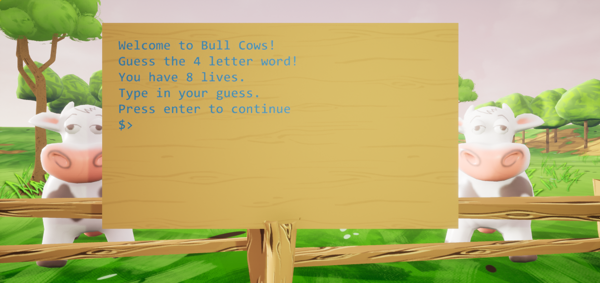

   
  <h1>🐂 Bulls and Cows 🐄</h1>
  <strong>C++ Unreal Engine Game</strong>
   
   
  
   

 

  
  

## About ❓️

Bulls and Cows is my first game developed in Unreal Engine. It is a console game where the player has to guess the hidden isogram. An isogram is a word with no repeating letters, or more broadly, a word in which all the letters occur once only.

## How to Play 🎮
The game will begin with the program choosing an isogram from a list of words.
 
The player gets (length of isogram) x 2 amount of tries to guess the word. The amount of tries will decrement only if the player makes a guess that is incorrect and is the same length as the hidden isogram. 
 
When the player types in a guess, the game will return the number of Bulls and Cows for each guess. 
 
Bulls are letters that exist in the hidden isogram and are in the right spot. Cows are letters that exist in the hidden isogram, but are in the wrong spot.

## Example 📝
Hidden Isogram: cakes
 
The player gets 10 lives.
 
 
Player Input: kites
 
 
The game will tell the player:
 
2 Bulls and 1 Cow

Explanation:
 
2 Bulls because 'e' and 's' exist in both words and are in the same spots
 
1 Cow because 'k' exists in both words, but is not in the same spot
